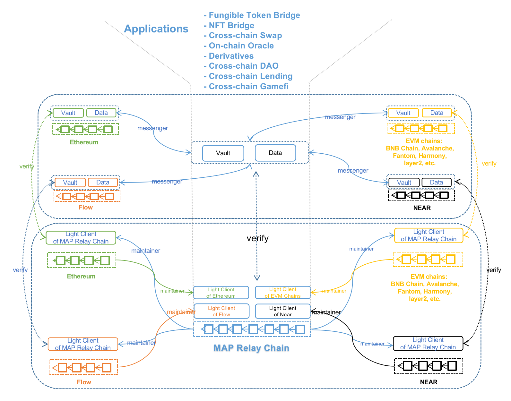

MAP Protocol is structured in **three layers**: **MAP Protocol Layer**, **MAP Cross-chain Services Layer(MCS)**, and **MAP Application Ecosystem Layer**.

## MAP Application Layer

- Assets and data originated from Dapps assembly on MAP Relay Chain.
- Dapps can achieve interoperability because of MAP Cross-chain Services (MCS).
- The finality of cross-chain data and asset verification network by MAP Protocol Layer empowers Dapps to grow limitless.

## MAP Cross-chain Services Layer (MCS)

- Facilitate Dapp developers to build applications, similar to Google Mobile Services.
- Consists of Vaults and Data deployed on each chain, and Messenger Program to transmit messages between chains.
- The execution layer for cross-chain assets and data.
- Dapp developers can build their components or use MCS.
- Developers can utilize Vaults and Data in MSC and share Vaults and Data liquidity with other applications.
- Messenger Program is an SDK deployed, operated, and maintained by Dapp developers. Dapp developers can also independently and flexibly incentivize messenger contributors for transmitting cross-chain messages for the Dapp.
- The self-verification mechanism of the Light-client on the MAP Protocol Layer assures the invalidity of malicious attacks from messengers.

## MAP Protocol Layer

- Construct the CORE of Cross-chain Infrastructure: Verification Finality Network and Dapp Deployment
- Consists of: MAP Relay Chain, Light-Client deployed on each chain, and inter-chain Maintainer Program to update and maintain Light-Client status.
- MAP Relay Chain proactively extends and supports heterogeneous blockchains' features in virtual machines, which construct a gas-efficient Light-Client verification network.
- Light-Client deployed on each chain has the characteristics of independent self-verification and verification finality, which becomes the verification network for cross-chain assets and data.
- The Maintainer is an independent inter-chain program responsible for updating the status of Light Clients. The mechanism of the Light-client assures the invalidity of malicious attacks from maintainer.
- MAP Protocol is this Layer in the narrow sense.
- MAP Protocol incentivizes validators on MAP Relay Chain and Maintainers for updating Light-Client status. 

