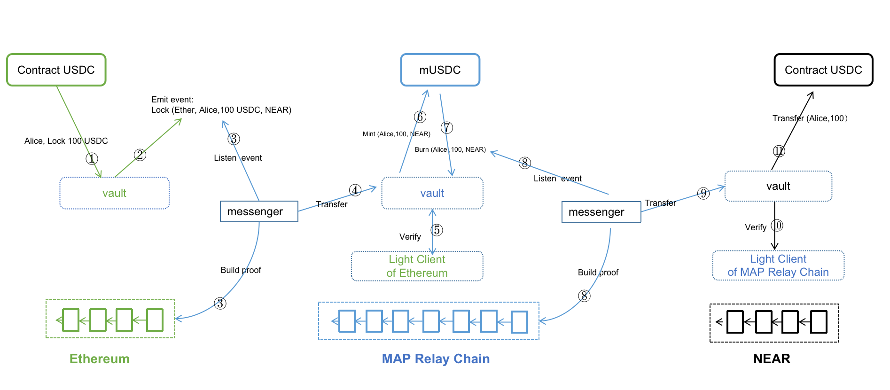

Assets and data originated from Dapps assembly on MAP Relay Chain. Dapps can achieve interoperability because of MAP Cross-chain Services (MCS). The finality of omnichain data and asset verification network by MAP Protocol Layer empowers Dapps to grow limitless.

## Cross-chain Lending

Currently, if a user has money on chain A but wants to farm on Chain B, the user would have to go through 9 steps: 

Collateralize on Chain A -> borrow -> bridge (fee) -> swap (fee) -> farm on the destination chain -> swap back (fee) -> bridge back (fee) -> repay the loan -> un-collateralize. 

With MAP Protocol, you can collateralize on Chain A, borrow on the destination chain, farm, repay, and the collateral is unlocked, skipping the four bridging and swapping fees.

## Omnichain Swap

Omnichain Swap allows you to swap coins with substantially lower fees than traditional DeFi exchanges by connecting you to the best cross-chain DeFi protocols. By using MAP Protocol, developers can build a truly decentralized omnichain exchange that enables users to swap any token on any chain.
 
Omnichain SWAP also enables omnichain aggregation swap by connecting every major DEX liquidity out there. Existing AMMs can be wrapped to perform omnichain swaps from one asset to another without the need to modify any existing code. User’s will be able to swap from ETH on Ethereum to Near on Near in one single transaction from the source chain.

In an omnichain swap built with MAP Protocol, users can add multichain coin liquidity in one pool, that means providing liquidity to a pair of tokens from different chains becomes possible. Users can swap one token directly for another chain token from a different chain without using any intermediate token, such as stable coins, to achieve the shortest route of omnichain swap.

**BarterSwap**, the first truly decentralized cross-chain exchange that enables users to swap any token on any chain, includes all the above functionalities and will be released in Q4 2022. 

## Omnichain GameFi

As the crypto industry and the idea of metaverse boomed, a lot of innovative ideas were brought to the traditional gaming sector. Gaming Finance refers to the gamification of financial systems to create profit through participation in play-to-earn crypto games. The play-to-earn games are different from conventional games since players participate to earn rewards, and players can create in-game assets with complete control over ownership. 

The lifespan of a GameFi depends heavily on the popularity and user's gaming experience. To maintain popularity, a new source of players is the key, and the best way is to expand to other chains so that users from other chains can participate. With MAP Protocol, GameFi Projects can deploy their tokens on multiple chains and allow users from other chains to efficiently and securely transfer their assets to their project's chain. For example, an BSC GameFi project deployed its tokens on Polygon and WAX chains; Users from Polygon and BSC can transfer their assets to WAX through the cross-chain bridge and participate in the GameFi, increasing the user base exponentially. 

Another way to be scalable and maintain a good gaming experience is directly deploying on MAP Relay Chain. With MAP Relay Chain's interoperability, GameFi projects can automatically link up with all EVM and non-EVM chains efficiently and securely by deploying on MAP Relay Chain. MAP Relay Chain will proactively connect with all of the upcoming chains so that the GameFi project can focus on user experience without worrying about scalability and security problems. 

## On-chain Oracle and Derivatives

Decentralized derivative and synthetic assets are usually constrained by the accuracy and timeliness of asset prices and quantities originating from other chains. This issue can be solved by multi-chain deployment, but it is extremely complex. By building a reliable omnichain network, MAP Protocol has enabled Data cross-chain and is nurturing a completely new oracle market - On-Chain Oracle. By deploying on MAP Relay Chain, derivative and synthetic asset applications can easily acquire reliable multi-chain data from On-Chain Oracle. 

### Illustration of MAP Protocol Omnichain Applications - Data

Decentralized derivative and synthetic assets are usually constrained by the accuracy and timeliness of asset prices, and quantities originated from other chains. This issue can be solved by deploying on multiple chains but is extremely complex. By building a reliable cross-chain network, MAP Protocol has enabled Data omnichain and is nurturing a completely new oracle market - **On-Chain Oracle**. By deploying on MAP Relay Chain, derivative and synthetic asset applications can acquire reliable multi-chain data from On-Chain Oracle with ease. 

## Fungible token and NFT Bridge

Cross-chain bridges and cross-chain NFT bridges no longer have to build their infrastructure or use MPC. Using MAP’s underlying cross-chain verification network with finality and the MCS application developer service kit, bridge developers can easily build their NFT or homogenized token bridge application. 

### Illustration of MAP Protocol Omnichain Application - Fungible Tokens

*Fungible tokens like USDC are issued simultaneously on multiple chains. Dapp developers need to submit whether fungible tokens are issued on multiple chains on the MAP Cross-chain services' vault to avoid different forms of the same assets created during the omnichain process.

### Illustration of MAP Protocol Omnichain Application - Non-Fungible Tokens (NFT)

## Omnichain Governance - The case of Aave

As told by its developers, a proposal executed on Aave, which is built on the Ethereum (ETH) network, was sent to the Polygon (MATIC) FxPortal. The mechanism then read the Ethereum data and passed it for validation on the Polygon network. Afterward, the Aave cross-chain governance bridge contract received this data, decoded it and queued the action, pending a timelock for finalization. The development team wrote:

The Aave cross-chain governance bridge is built in a generic way to be easily adapted to operate with any chain that supports the EVM and cross-chain messaging. Currently, the repository supports contracts bridging to Polygon and Arbitrum. On Aave, users can submit Aave Improvement Protocols, or AIPs, to target various features on the DeFi platform.
 
With MAP Protocol's interoperability with all-chains, omnichain governace can be achieved with all EVM and heterogenous chains by a security cross-chain infrastructure. 

## Omnichain Applications on MAP Protocol

Dapp developers only need to deploy their dapps on MAP Relay Chain with the completed MAP omnichain services module, then enjoy the privilege of connecting the entire blockchain world’s liquidity. Developers can easily build their omnichain applications deployed on any chain in just two steps:

1. Build inter-chain messenger using our SDK.
2. Interact with on-chain vault and data through our API.

| Dapp Categories | Projects under development on MAP Protocol as of Apr 2022 |
| ---- | ---- |
| Fungible Token Bridge | Barter Bridge |
| NFT Bridge | CoLAB NFT Bridge |
| Cross-chain NFT Collaboration Platform | CoLAB |
| Cross-chain Swap | BarterSwap |
| Cross-chain DAO | Idavoll DAO |
| MAP Relay Chain Swap | HiveSwap |
| Off-chain Oracle | Nest |
| On-chain Oracle | Onchain Oracle |
| Cross-chain Farm | UniFarm |
| Cross-chain GameFi | Nextype, Spiritland |
| Wallet | BeFi Wallet DAO, Bitkeep, MathWallet, Coin98 |
| Payment | Alchemy Pay |
| DeFi System | Ecentive |
| Staking Service | Kucoin, Ankr, Hashquark, 01Node, Allnodes, Infstone |
