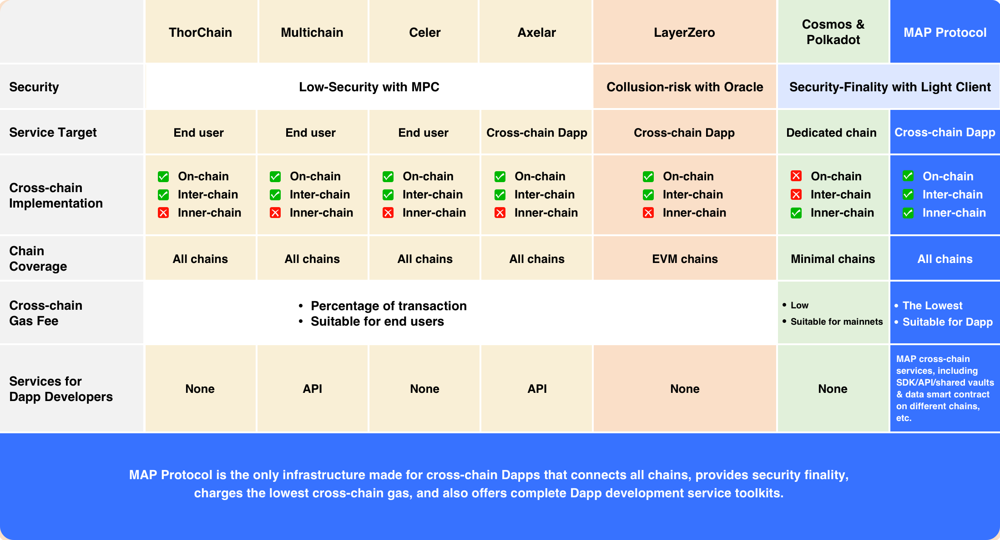

MAP Protocol is the only infrastructure made for cross-chain Dapps that connects all chains, provides security finality, 
charges the lowest cross-chain gas, and also offers complete Dapp development service toolkits. 
Build on the best cross-chain infrastructure now.

