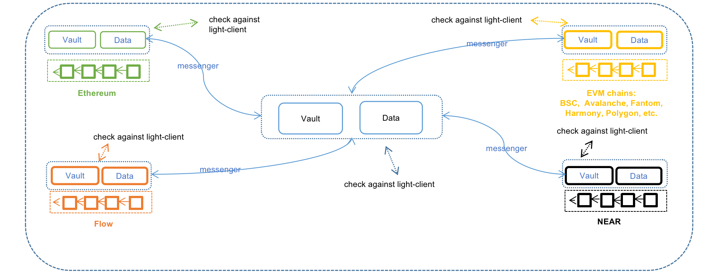

Although it’s impossible to capture and satisfy all cross-chain Dapps’ needs once and for all, there are indeed common facilities underlying various cross-chain Dapps, e.g. both cross-chain bridge and cross-chain swap need to deal with the cross-chain transfer fungible or non-fungible assets. To this end, MAP protocol provides MAPO Service (MOS) to provide common modules needed by cross-chain Dapps to further lower the threshold of building cross-chain Dapps with MAP protocol. Ideally, with MAP protocol, developers trying to build cross-chain swap Dapps only need to focus on the swap part. MOS alone cannot meet all the needs, thus MOS also provides all the facilities needed to extend existing modules.

Assets management of cross-chain transfers is quite error-prone and usually comes with a super admin who is capable of touching user funds. Nowadays, cross-chain transfer is the essential component for cross-chain interoperability, MOS provides a trustless and solid AssetVault module to relieve MAP ecosystem builders from the burden of technical challenge and security risks. To help understand the MAP protocol as well as the functions provided by MOS, we illustrate the workflow of cross-chain transfer utilizing the AssetVault module provided by MOS. AssetVault module is composed of bulletproof smart contracts dealing with cross-chain transfers and guarding users' funds. There is no privileged admin and all asset-related operations such as minting, burning, and more can only be triggered with a cross-chain message backed up by valid cryptographic proof, e.g., a Merkle proof. The cryptographic proof is checked against the information provided by the light clients.

Suppose Ethereum and Binance Smart Chain are already supported by MAP protocol and Alice wants to transfer 100 USDC from Ethereum to BSC with MAP protocol. Note that before Alice doing anything, MAP protocol already deployed light client of MAPO Chain on both Ethereum and BSC, called MapLightClientOnEth and MapLightClientOnBsc, and Messengers are continuously update both light clients according to MAPO Chain growth. Also EthLightClientOnMap and BscLightClientOnMap are already deployed on MAPO Chain and Messengers are already updating both light clients according to the update of Ethereum and BSC. Also there is an AssetVault contract deployed on MAPO Chain, Ethereum and BSC.

Cross-chain assets are locked in the AssetsVault contract on the source chain. For assets moving to MAPO Chain, MAPO Chain will wrap all assets from different chains, e.g., mUSDC is the wrapped USDC on MAPO Chain for USDC on Ethereum, BSC, etc. Let’s illustrate what really happens behind the scenes if Alice is using MAP protocol to move 100 USDC from Ethereum to BSC via MAPO Chain.

1. Alice interacts with the contract AssetsVault on Ethereum, to lock her 100 USDC to AssetsVault.

a. After the transaction is packed and successfully executed by Ethereum, a Lock event is emitted indicating that Alice has indeed locked 100 USDC in AssetsVault to move the fund to BSC.

2. One Messenger spots the Lock event emitted by AssetsVault on Ethereum and builds Merkle proof to prove that this event is emitted by AssetsVault at a certain block height. With all the information ready, this Messenger submitted a proper transaction to AssetsVault on MAPO Chain.

a. After the transaction is packed and during the execution of this transaction, AssetsVault on MAPO Chain queries contract EthLightClientOnMap to get the Merkle root at the corresponding block height and validate the cryptographic proof carried in the transaction.

b. If the cryptographic proof passes the check and the corresponding event is not processed yet, AssetsVault will instruct contract mUSDC to mint 100 mUSDC for Alice.

c. Then in the same transaction, the minted 100 mUSDC is burned and an event is emitted indicating that Alice is burning 100 mUSDC in order to have 100 USDC on BSC.

3. One Messenger spots the Burn event emitted by contract mUSDC on MAPO Chain and builds the corresponding Merkle proof to prove that this event is emitted by contract mUSDC at certain block height of MAPO Chain. With all the information ready, this Messenger submitted a proper transaction containing Burn event, the Merkle proof as well as the block header to contract AssetsVault on BSC.

a. If the transaction is packed and during the execution of this transaction, AssetsVault on BSC queries contract MapLightClientOnBsc to verify that the block header is valid (by checking the aggregate signature embedded in the block header) and extract Merkle root from verified block header to further  validate the cryptographic proof carried in the transaction.

b. If the cryptographic proof passes the check and the corresponding event is not processed yet, contract AssetsVault will transfer 100 USDC to Alice’s address. Now Alice’s 100USDC has been successfully transferred from Ethereum to BSC.

Note that if Alice transfers 100 USDC from Ethereum to MAPO Chain, then she will end up with 100 mUSDC sitting in her address on MAPO Chain. No trusted parties are involved in the above processing. All state changes related to the assets moving are driven by the proper cross-chain messages with cryptographic proof submitted by Messengers. In the above procedure, Alice only needs to send one transaction and all the rest are taken care of by Messengers in a pure trustless way.

### Illustration of MAP Protocol's MAPO Services (MOS) Layer

## Messenger
- What is Messenger? Messenger is an independent inter-chain program.Messenger listens to relevant events as preset in the program and builds a proof on the ledger of the source chain; then transmit the message of the event and proof to Vault or Data on the destination chain.
- Messenger needs to prepay the gas fee of MAPO Chain and the destination chain for omnichain users and thus get rewards from applications.
- As gas fees of destination chains cannot be estimated, MAP Protocol Layer cannot include this process into the bottom network because of the principle of absoluteness adopted by MAP Protocol.
- The flexibility of applications opens up many possibilities for Messenger, where applications can charge omnichain users flexible transaction fees and reward Messenger accordingly. 
- As a main component of MAPO Services, Messenger SDK is open to dApp developers.
- Messenger is a high concurrency inter-chain program. Theoretically, as long as one honest Messenger is working in between chains, all cross-chain transactions messages of the dApp can be transferred.
- Malicious attacks by messengers will not cause the loss of assets and will only result in invalidity of verification on the MAP Protocol Layer.  

## Vault & Data
- On the source chain, Vault & Data are responsible for receipt of assets or data and trigger an event for Messengers to listen to.
- On relay chain or destination chain, Vault & Data are responsible for receiving cross-chain messages transmitted by Messengers, then through an internal component - router to schedule and conduct the verification of cross-chain transactions via Light-Client of the source chain deployed on destination chain. - When verification completes, Vault & Data will record the corresponding instruction.
dApp developers can deploy vault & Data. They can also share the liquidity of asset vaults or data pools via MAPO Services' Vault & Data.
