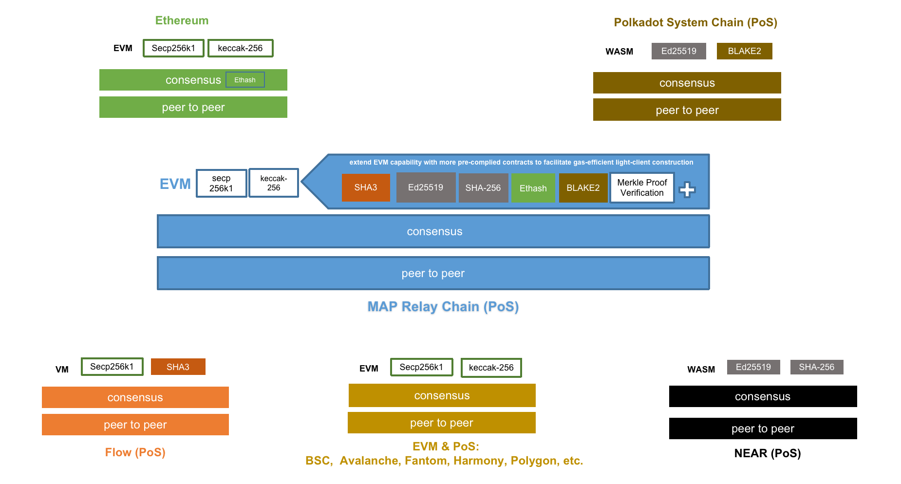

### Illustration of MAP Protocol Layer: MAP Relay Chain's Underlying Layer Isomorphism with All Chains

Precompiled contracts are a compromise used in the EVM to provide more complex library functions (usually used for complex operations such as encryption, hashing, etc.) that are not suitable for writing in opcode. They are applied to contracts that are simple but frequently called, or that are logically fixed but computationally intensive. Precompiled contracts are implemented on the client-side with client code, and because they do not require the EVM, they run fast. It also costs less for developers than using functions that run directly in the EVM.

For more details: [precompile contract](https://docs.maplabs.io/develop/map-relay-chain/precompile-contract)
