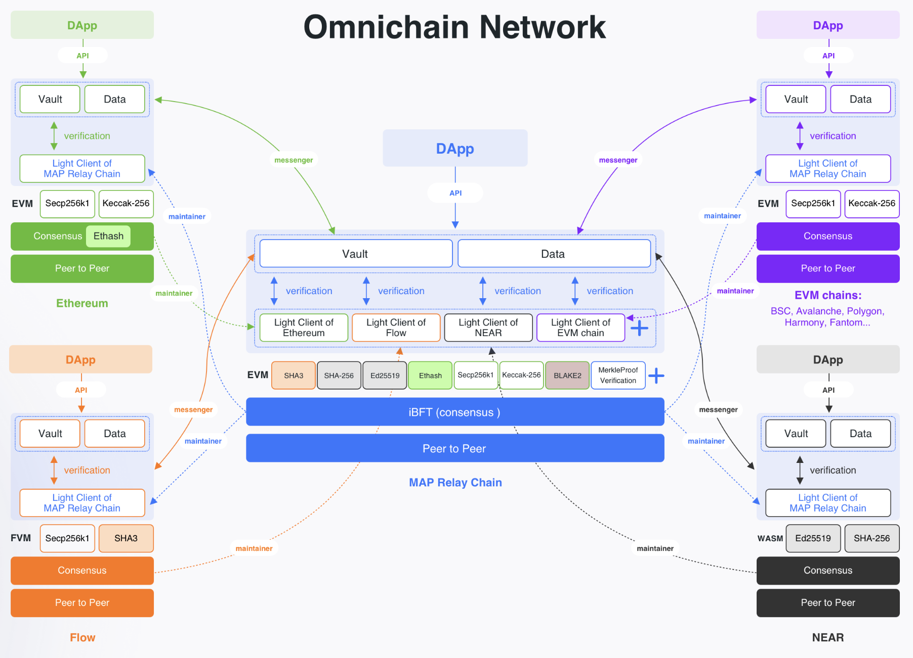

While cross-chain bridges can be easily built with MAP Protocol, MAP Protocol itself tackles a more fundamental problem and pursues a larger vision: boosting the whole cross-chain ecosystem **by building an omnichain network infrastructure**. Any dApp built with the infrastructure **utomatically inherits the omnichain nature of MAP Protocol** without requiring the developers to tackle the error-prone cross-chain communications. With the technical threshold of building omnichain dApp reduced, the ecosystem shall thrive.

1. MAP Protocol is structured in **three layers: Protocol Layer, Cross-chain Services Layer (MCS), and Application Layer.  
2. MAP Protocol achieves omnichain interoperability with **all EVM and non-EVM chains** by deploying cross-chain execution and verification via on-chain smart contracts, and cross-chain messenger inter-chain program.  
3. MAP Protocol's cross-chain verification network has **security finality** by adopting the Light-client independent self-verification mechanism.  
4. MAP Relay Chain is fully EVM compatible built upon **Proof-of-Stake** mechanism and **Byzantine Fault Tolerant consensus. 
5. MAP Relay Chain accomplished heterogeneous expansion on the EVM level, which simplified the complexity of engineering and **minimized the gas fee** for cross-chain verification between heterogeneous chains. 
6. By connecting with MAP Relay Chain, EVM and non-EVM chains form a cross-chain execution and verification network. 
7. MAP Protocol provides **SDK for the inter-chain communication component - Messenger** to dApp developers. Each dApp can have its own Messenger and tailor-make their reward scheme, which facilitates cross-chain transactions to be completed.
8. MAP Protocol provides developers with MAP Cross-chain Services similar to Google GMS. It is convenient for developers to develop and **share omnichain asset liquidity and data. 
9. MAP Protocol supports **both assets and data cross-chain.**
10. MAP Relay Chain supports the development of all omnichain dApps, including omnichain oracle, omnichain swap, cross-chain bridge for tokens and NFTs, decentralized derivatives, omnichain DAO, and omnichain GameFi, etc. 

### Technical Illustration of MAP Protocol

Developers can deploy omnichain dApps on MAP Relay Chain to achieve interoperability.  

