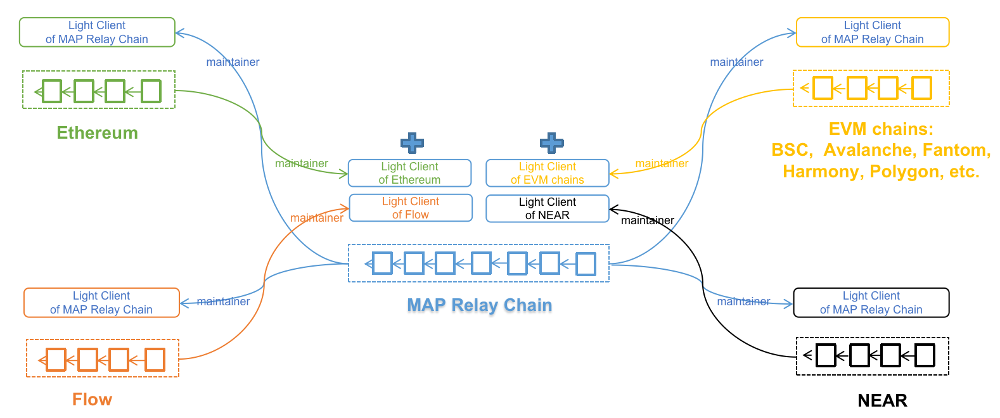

# Light Client

To validate the cryptographic proof for a cross-chain message, a trusted root is required. Normally the cryptographic proof is the existence Merkle proof of a specific value in a (variant) Merkle tree, e.g., the Merkle Patricia Tree (MPT) in Ethereum or Immutable AVL (IAVL+) tree used in Cosmos and the trusted root is the Merkle root of the tree that is usually included in block header. Then by feeding all block headers of all interested blockchains to the MAP relay chain, the availability problem of trusted root can be easily solved. Yet, with continuous efforts put into shortening the block generation internal, processing all uploaded block headers on MAP relay chain would consume considerable resources, especially when we are trying to connect more and more blockchains and blockchains like Binance Smart Chain, Polygon networks are already producing blocks every 2 or 3 seconds. Another problem is that, how to validate the correctness of the uploaded block headers? The design of MAP protocol is to remove all trusted parties, thus relying on trusted parties to upload correct block headers is clearly not an acceptable solution. Following the advancement of SPV technology and light client construction technology, both problems can be solved in a trustless way. The core observation is that almost all blockchains can reach consensus with very limited information.

## Light client of PoW chain

Nakamoto consensus-like chain, e.g.,  Ethereum, new block header can be easily checked following the consensus rules, e.g., the hash link as well as the accumulated work etc. If Ethereum network won’t re-org more than n blocks, then a light client of Ethereum only needs to preserve n+1 newest block headers to verify new block headers and update its internal state in an autonomous way. Considering the latency to relay the crossing-chain message, light clients built this way can store more block headers, e.g., block headers generated in the last 48 hours. With Ethereum’s ~13-second block interval, the light client on MAP relay chain only needs to store 13k Ethereum block headers. On the other hand, by adopting Flyclient technique, the number of blocks uploaded to MAP relay chain can be significantly reduced. Although the genesis state of a light client requires manual setup, the trustless feature is not compromised since any one can check the correctness of the genesis state. We conjecture that this is basically the same as the “weak subjective” concept populated in the Proof-of-Stake world.

**PoW Chain's Light-Client deployed on other chains**:
- Store the latest N block headers.
- Verify new block header following consensus protocol and self-update.
- Proof of certain txs: inclusion Merkle proof.
- Maintainer: Prepay the gas fees with Light-client updating for MAP Protocol and get rewards from MAP Protocol

## Light client of PoS chain

For Proof-of-Stake and BFT based blockchains, the construction of a light client might seem quite difficult at the beginning. Thanks to the work of the Tendermint team, it turns out that a more efficient light client can be built. While the technique detail could be quite lengthy, the core idea is simple. In such networks, blocks are signed off by a group of selected staked validators, so by verifying a few digital signatures, the validity of a block can be easily checked. The set of validators could change over time, but in typical PoS networks, a new set of validators also needed to be proved by the old set via signatures. In this way, with only a little information of the current validator set, e.g., staked weight, public keys of each validator set, a light client can easily check new block headers as well as updating itself. There is even no need to upload all block headers, only a tiny few, e.g., those involved in a cross-chain operation, or validate set upgrade.

Light clients on MAP relay chain are initialized as smart contracts, so that the chain can quickly add new light clients for new blockchains connected by the MAP relay chain. Merkle proof verification and digital signature verification are crucial to the construction and operation of light clients. But, implementing these cryptography primitives with Solidity is both tricky and inefficient, especially since various cryptography primitives are used in different blockchains. To ease the development of light clients, all kinds of cryptography primitives are supported at the blockchain level and are exposed to EVM via pre-compiled contracts.

**PoS Chain's Light-Client deployed on other chains**:
- Store validators' public key and vote weight - no need to store block header.
- Verify a new set of validators (authorized by the previous set) and self-update.
- Proof of certain txs or events: inclusion Merkle proof and corresponding block header info (contains signatures).
- Maintainer: Prepay the gas fees with Light-client updating for MAP Protocol and get rewards from MAP Protocol

*Note: Light-Client's independent and self-verification mechanism can guarantee verification finality and are manipulation-free. Initial state will be fully open to the public by MAP Protocol team

## Light client of MAP relay chain

Solely maintaining light clients of connected blockchains on MAP relay chain is not enough for bidirectional cross-chain interoperation in a trustless style, MAP protocol requires the existence of MAP relay chain’s light client on each connected blockchain. While on MAP relay chain, the gas price can be continuously optimized to stay as low as possible, on other chains, we must accept the reality. As MAP relay chain adopts PoS and IBFT, a light client can be easily built following the above technique. To optimize the gas consumption of the light client on other chains, MAP relay chain adopts aggregate  BLS signature over BN256 curve. In this way, the verification of the signatures of MAP relay chain’s validators can be reduced to verify only one aggregated signature with one aggregated public key. As the precompile contract of BN256 is widely supported by the EVM-compatible blockchain, the gas consumption of maintaining the MAP relay chain’s light client can be reduced.

**Illustration of MAP Protocol's Verification & Maintenance Network**

# Maintainer

Light clients of connected blockchains on MAP relay chain and light clients of MAP relay chain on connected blockchains need to keep up with the growth of the corresponding blockchains. This is the Maintainers’ responsibility. Maintainers in MAP protocol continuously monitor the blockchain growth of MAP relay chain as well as all the connected blockchains. New block headers of MAP relay chain are submitted to all connected blockchains to keep the light client of MAP relay chain updated. Meanwhile, new block headers of all connected blockchains are submitted to MAP relay chain to update various light clients living on MAP relay chain. In this way, MAP relay chains and each connected blockchain are aware of the most recent state of each other, and laid the foundation for cross-chain message verification.

After correctly set up, each light client can verify newer block headers according to its internal state as well as  the rules coded in the contract, so that dishonest Maintainers won’t be able to trick the light clients to accept invalid block headers. Or in other worlds, the security of MAP protocol does not rely on trusted relayers. As long as the light client is correctly initialized and the implementation correctly follows the corresponding blockchain’s consensus protocol, the correctness of the light client is guaranteed cryptographically. As submitting transactions to blockchains would consume gas, all Maintainers are rewarded with MAP tokens according to the useful work they have accomplished, e.g., the number of effective block headers submitted.
