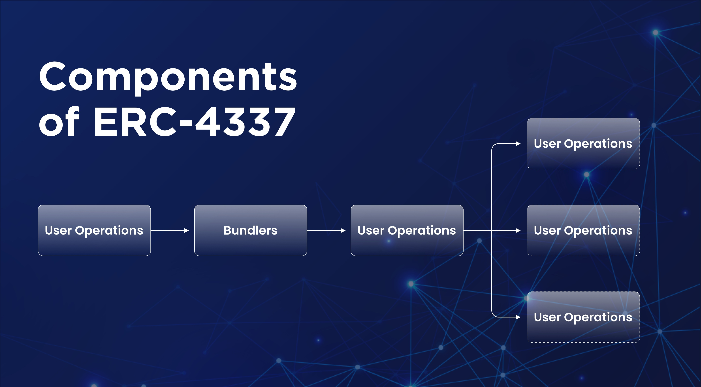

# Introduction

the simplified overview of ERC-4337 so that developers can get a basic understanding of the different components and how they can be pieced together to build their applications. more details for [ERC-4337](https://eips.ethereum.org/EIPS/eip-4337)



There are four main components to ERC-4337: a User Operation, Bundler, EntryPoint, and Smart Account (aka Contract Account). These can be supplemented by Paymasters and Aggregators.

+ UserOperations are pseudo-transaction objects that are used to execute transactions with contract accounts. These are created by your app.
+ Bundlers are actors that package UserOperations from a mempool and send them to the EntryPoint contract on the blockchain.
+ EntryPoint is a singleton smart contract that handles the verification and execution logic for transactions.
+ Contract Accounts are smart contract accounts owned by a user.
+ Paymasters are optional smart contract accounts that can sponsor transactions for Contract Accounts.
+ Aggregators are optional smart contracts that can validate signatures for multiple Contract Accounts.

## User Operations

All components of ERC-4337 revolve around a pseudo-transaction object called a UserOperation which is used to execute actions through a smart contract account. It captures the intent of what the user wants to do. This isn't to be mistaken for a regular transaction type.

| Field                | Type    | Description                                                                                                                                                          |
| -------------------- | ------- | -------------------------------------------------------------------------------------------------------------------------------------------------------------------- |
| sender               | address | The address of the smart account sending the User Operation.                                                                                                         |
| nonce                | uint256 | Anti-replay protection.                                                                                                                                              |
| initCode             | bytes   | Code used to deploy the sender if not yet on-chain.                                                                                                                  |
| callData             | bytes   | Data that's passed to the sender for execution.                                                                                                                      |
| callGasLimit         | uint256 | Gas limit for the execution phase.                                                                                                                                   |
| verificationGasLimit | uint256 | Gas limit for the verification phase.                                                                                                                                |
| preVerificationGas   | uint256 | Gas to compensate the bundler for the overhead to submit the User Operation.                                                                                         |
| maxFeePerGas         | uint256 | Similar to EIP-1559 maxFeePerGas                                                                                                                                     |
| maxPriorityFeePerGas | uint256 | Similar to EIP-1559 maxPriorityFeePerGas.                                                                                                                            |
| paymasterAndData     | bytes   | Paymaster contract address and any extra data the paymaster contract needs for verification and execution. When set to 0x or the zero address, no paymaster is used. |
| signature            | bytes   | Used to validate a User Operation during verification.                                                                                                               |

## Bundler

A Bundler is a class of actors that sends User Operations to the EntryPoint. Specifically, it:

+ Listens to at least one UserOperation mempool.
+ Runs simulations.
+ Bundles an array of User Operations.
+ Relays bundles to the EntryPoint.

the bundler [rpc](/develop/map-relay-chain/account-abstraction/bundler.md)

## EntryPoint

The EntryPoint is a singleton contract that acts as a central entity for all ERC-4337 Smart Accounts and Paymasters. It coordinates the verification and execution of a User Operation. For this reason, it's important for all implementations of an EntryPoint to be audited and immutable.

## Smart Account

The Smart Account is an end user's account. At minimum it needs to check whether or not it will accept a User Operation during the verification loop.

Additional features to support other account functions like social recovery and multi-operations can be added here too.

## Paymaster

The Paymaster is an entity that is able to sponsor the gas fees of a UserOperation. It is required to do two things:

Check whether or not it will accept a User Operation during the verification loop.
Run any required fee logic in the execution loop.
An example of Paymaster logic could be to withdraw a certain amount of ERC-20 tokens from the Smart Account after the UserOperation is executed. This allows users to pay for gas in any currency they choose.

## Aggregator

The Aggregator is an entity that is trusted by Contract Accounts to validate signatures. They are often used to aggregate signatures from multiple UserOperations together.

## Example

userop.js is an open-source library for building ERC-4337 **User Operation**s. Similar to how[ ethers.js](https://docs.ethers.org/v5/) allows developers to easily create traditional EVM transactions, userop.js allows developers to create and send **User Operation**s to ERC-4337 **Bundler**s.

userop.js is available as an npm package [here](https://www.npmjs.com/package/userop). To install, simply use your package manager of choice.

```shell
npm install userop
```

create AA account

```typescript
import { ethers} from "hardhat";
import { Client,Presets} from "userop";

async function createAccount() {
    let rpcUrl = "bunlder rpc url";

    let [wallet] = await ethers.getSigners()

    const client = await Client.init(rpcUrl);
    const simpleAccount = await Presets.Builder.SimpleAccount.init(
        wallet, // Any object compatible with ethers.Signer
        rpcUrl,
        {salt:4 } 
    );
  
    console.log("create aa account address:",simpleAccount.getSender());

    //create account should fund to aa account to pay gasfee
    await ( await wallet.sendTransaction({
    to:simpleAccount.getSender(),
    value:ethers.utils.parseEther("0.1")
    })).wait()

    const response = await client.sendUserOperation(simpleAccount);
    console.log("response:",responses)
    let result = await response .wait();
    console.log("result :",result)
}

//log out
response : {
  userOpHash: '0x95d3b8370135d8a119193769bfc8efa989c222e9e5a05389d00235754638ef41',
  wait: [Function: wait]
}

result: {
  blockNumber: 39112697,
  blockHash: '0x68be0951f99566f373772667a7541b94e908281a118db91df38850a3c3f290c1',
  transactionIndex: 4,
  removed: false,
  address: '0x5FF137D4b0FDCD49DcA30c7CF57E578a026d2789',
  data: '0x00000000000000000000000000000000000000000000000000000000000000000000000000000000000000000000000000000000000000000000000000000001000000000000000000000000000000000000000000000000000258dcbed710b0000000000000000000000000000000000000000000000000000000000005f287',
  topics: [
    '0x49628fd1471006c1482da88028e9ce4dbb080b815c9b0344d39e5a8e6ec1419f',
    '0x95d3b8370135d8a119193769bfc8efa989c222e9e5a05389d00235754638ef41',
    '0x000000000000000000000000fbabb502d1c77bbede567ce338d8fcbef7cbacde',
    '0x0000000000000000000000000000000000000000000000000000000000000000'
  ],
  transactionHash: '0x89d8b99ffd4de3aae066e8b8ee22efe8ee21e117471b3a6737356202972bf6a3',
  logIndex: 33,
  removeListener: [Function (anonymous)],
  getBlock: [Function (anonymous)],
  getTransaction: [Function (anonymous)],
  getTransactionReceipt: [Function (anonymous)],
  event: 'UserOperationEvent',
  eventSignature: 'UserOperationEvent(bytes32,address,address,uint256,bool,uint256,uint256)',
  decode: [Function (anonymous)],
  args: [
    '0x95d3b8370135d8a119193769bfc8efa989c222e9e5a05389d00235754638ef41',
    '0xFbAbB502d1C77bBeDE567cE338D8FCBEF7cBaCdE',
    '0x0000000000000000000000000000000000000000',
    BigNumber { value: "0" },
    true,
    BigNumber { value: "660655071236272" },
    BigNumber { value: "389767" },
    userOpHash: '0x95d3b8370135d8a119193769bfc8efa989c222e9e5a05389d00235754638ef41',
    sender: '0xFbAbB502d1C77bBeDE567cE338D8FCBEF7cBaCdE',
    paymaster: '0x0000000000000000000000000000000000000000',
    nonce: BigNumber { value: "0" },
    success: true,
    actualGasCost: BigNumber { value: "660655071236272" },
    actualGasUsed: BigNumber { value: "389767" }
  ]
}

```

transfer native token from AA account

```typescript
import { ethers} from "hardhat";
import { Client,Presets} from "userop";

async function createAccount() {
    let rpcUrl = "bunlder rpc url";

    let [wallet] = await ethers.getSigners()

    const client = await Client.init(rpcUrl);
    const simpleAccount = await Presets.Builder.SimpleAccount.init(
        wallet, // Any object compatible with ethers.Signer
        rpcUrl,
        {salt:4 }
    );
  
    console.log("create aa account address:",simpleAccount.getSender());

    //create account should fund to aa account to pay gasfee
    await ( await wallet.sendTransaction({
    to:simpleAccount.getSender(),
    value:ethers.utils.parseEther("0.1")
    })).wait()

    const response  = await client.sendUserOperation(simpleAccount);
    console.log("result :",response)
    let result = await response.wait();
    console.log("result:",result)
}

```

transfer ERC20 Token from AA account

```typescript
import { ethers} from "hardhat";
import { Client,Presets} from "userop";


async function transferERC20Token() {
    let rpcUrl = "bundler rpc url";
    let token_addr = "token address";

    let [wallet] = await ethers.getSigners()

    let ERC20_abi = [
        "function transfer(address to, uint256 amount) external returns (bool)"
     ]
 
     let ERC20 = await ethers.getContractAt(ERC20_abi,token_addr,wallet);


    const client = await Client.init(rpcUrl);
    const simpleAccount = await Presets.Builder.SimpleAccount.init(
        wallet, // Any object compatible with ethers.Signer
        rpcUrl,
        {salt:4 }
    );
    await(await ERC20.transfer(simpleAccount.getSender(),ethers.utils.parseEther("100"))).wait()
    simpleAccount.execute(token_addr,0,ERC20.interface.encodeFunctionData("transfer",[wallet.address,ethers.utils.parseEther("50")]));
    const response = await client.sendUserOperation(simpleAccount);
    console.log("response :",response)
    let result = await response.wait();
    console.log("result:",result)
}
```
