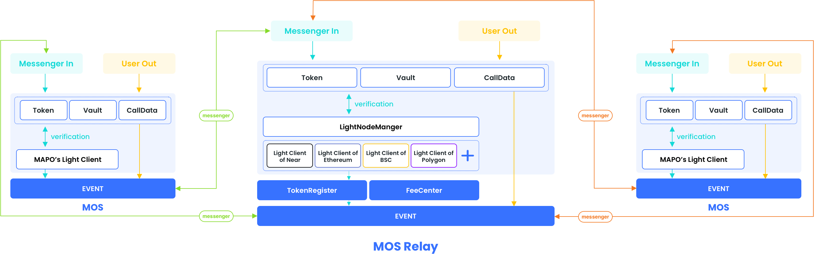

# How MOS works

## Glossary

### MOS relay

MOS relay is the main contract on MAP Relay Chain, which is mainly responsible for handling everything on MAP Relay Chain. Its main functions are as follows:
- Handle users' cross-chain transfers

- Handle the cross-chain transfer of the Maintainer

- Responsible for calling the LightNodeManager contract to verify the message and analyze related events

- Responsible for the transaction forwarding of other chain MOS contracts

- Responsible for managing the issuance and recovery of tokens and Vault rights of tokens

- Responsible for the processing of handling fees

  

### MOS

MOS is the main contract on the source chain. It is mainly responsible for processing things from MAP Relay Chain. Its main functions are as follows:
- Handle users' cross-chain transfers

- Handle the cross-chain transfer of the Maintainer

- Responsible for calling the LightNode contract to verify the things on the MAP Relay Chain, and analyze related events

  

### Vault

Vault is an equity token contract corresponding to each cross-chain token, and its main functions are as follows;
- Pledge the user's liquidity and issue the equity token VToken
- Record cross-chain fees and distribute them equally to liquidity providers
- Extraction and transfer of liquidity

### Fee

Fee is a collection and management contract for user cross-chain fees, which is distributed in the MOS Relay contract. Its main functions are as follows:

- Set the fee distribution ratio of vault, relay and protocol
- Set the charging standard of the handling fee

### Proof verification

Proof verification is to prove the proof to confirm that the cross-chain data is legal. The general verification process is encapsulated in LightNode, and the process is as follows:
- Prove that Proof can be verified in the transaction body
- Prove that the transaction body can construct ReciptRoot
- Prove that ReciptRoot is in the header
- Verify the validity of the Header according to the Header collection stored in the LightNodeds

## How it works

### Token transfer

**transfer out**

​	The main process of cross chain transfer out is as follows:

- User authorized asset deduction

- The user calls the contract to specify the cross chain chainId and quantity, and the contract deducts the corresponding quantity

- The contract maps the token of the target chain and calculates the service charge and quantity (MOS Relay) deducted according to the token decimal

- Deduction of handling charges and distribution according to TokenRegister registration information (MOS Relay)

- Generate the out information into the order and the transferOut event output

**transfer relay**

​	The main process of the Maintainer monitoring information transferring out and calling the corresponding transferIn is as follows:

- Scan MOS/MOS Relay's transferOut event

- Generate corresponding Proof according to Event and Chain

- Form the proof data and event into the transferIn of the transaction call target chain

**transfer in**

   The main process of cross chain transfer in of maintainer is as follows:

- Proof verification

- Parse the corresponding transOut data

- The contract maps the token of the target chain and calculates the service charge and quantity (MOS Relay) deducted according to the token decimal

- Deduction of handling charges and distribution according to TokenRegister registration information (MOS Relay)

- Judge whether it is a transfer to the MAP Relay Chain, if it is the next step, and if it is not the order generated from the out information and the transferOut event output (MOS Relay) generated

- Transfer out cross chain assets to users

### Vault deposit

**deposit out**

   The main process of MOS chain user pledge liquidity is as follows:

- User authorized asset deduction

- The user calls the contract to specify the cross chain chainId and quantity, and the contract deducts the corresponding quantity

- Generate the disposition information into an order and generate the disposition Out event output

  

**deposit in**

​	The initial application process of MOS (Maintainer) pledge liquidity is as follows:

- Proof verification

- Resolve the corresponding depositOut data

  

​	The initial process for MOS Relay chain users to pledge liquidity is as follows:

- User authorized asset deduction

- The user calls the contract to specify the cross chain chainId and quantity, and the contract deducts the corresponding quantity

  

​	The process behind MOS (Maintainer)/MOS Relay is as follows:

- Generate the corresponding equity token Vtoken to the user according to the quantity pledged by the user

- Generate the corresponding depositIn event