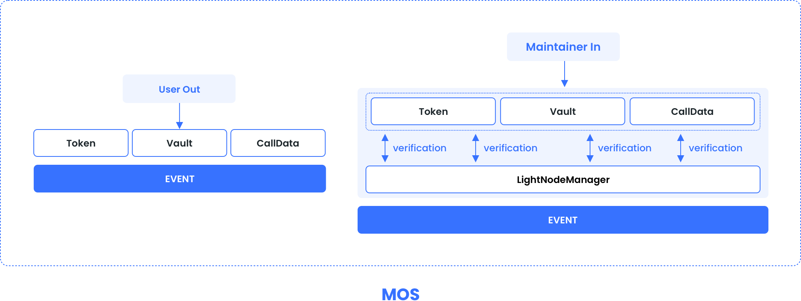

# EVM Chains Contract



## Contract Address

[Here to get MAPO mainnet and testnet MCS contract address.](/develop/mos/mcs/README.md)


## contract interface 

```solidity
interface EvmChainContract {
    function initialize(address _wToken, address _lightNode)external;
    
    function transferOutToken(address _token, bytes memory _to, uint256 _amount, uint256 _toChain) external;
    
    function transferOutNative(bytes memory _to, uint _toChain) external;
    
    function depositToken(address _token, address _to, uint _amount) external;
    
    function depositNative(address _to) external;
    
    function transferIn(uint256 _chainId, bytes memory _receiptProof) external;
    
    function isBridgeable(address _token, uint256 _toChain) public view returns (bool);
    
    function isMintable(address _token) public view returns (bool);
 
}
```

## User Interface


### transferOutToken

Cross-chain transfer out token

#### function

function transferOutToken(address _token, bytes memory _to, uint256 _amount, uint256 _toChain) external

#### parameters

| parameter | type    | comment                                                      |
| --------- | ------- | ------------------------------------------------------------ |
| _token    | address | Token address to transfer tokens from                        |
| _to       | bytes   | The destination chain receiving address of the token to be transferred out |
| _amount   | uint256 | Amount of tokens to be transferred                           |
| _toChain  | uint256 | Target chain id to transfer out                              |

### transferOutNative

Cross-chain transfer out of the native coin

#### function

function transferOutNative(bytes memory _to, uint _toChain) external

#### parameters

| parameter | type    | comment                                                      |
| --------- | ------- | ------------------------------------------------------------ |
| _to       | bytes   | The destination chain receiving address of the token to be transferred out |
| _toChain  | uint256 | Target chain to transfer out                                 |

### depositToken

Deposit token to vault

#### function

function depositToken(address _token, address _to, uint _amount) external

#### parameters

| parameter | type    | comment                               |
| --------- | ------- | ------------------------------------- |
| _token    | address | Token address to transfer tokens from |
| _to       | address | Target chain to transfer out          |
| _amount   | uint    | Amount of tokens to be deposited      |

### depositNative

Deposit native coin to vault

#### function

function depositNative(address _to) external

#### parameters

| parameter | type    | comment                                                      |
| --------- | ------- | ------------------------------------------------------------ |
| _to       | address | The destination chain receiving address of the token to be transferred out |


## Messenger Interface

### transferIn

Perform cross-chain transfer

#### function

function transferIn(uint256 _chainId, bytes memory _receiptProof) external

#### parameters

| parameter     | type    | comment                       |
| ------------- | ------- | ----------------------------- |
| _chainId      | uint256 | source chain id               |
| _receiptProof | bytes   | source  chain  transfer proof |


## Management Interface

### initialize

perform initialization

### function

function initialize(address _wToken, address _lightNode)public 

### parameters

| parameter  | type    | comment                                  |
| ---------- | ------- | ---------------------------------------- |
| _wToken    | address | This is wrap contract address            |
| _lightNode | address | This is the LightClient contract address |


## Data structure

ReceiptProof includes the proof and the receipt to prove.

```
struct istanbulExtra {
    //Addresses of added committee members
    address[] validators;
    //The public key of the added committee member
    bytes[] addedPubKey;
    //G1 public key of the added committee member
    bytes[] addedG1PubKey;
    //Members removed from the previous committee are removed by bit 1 after binary encoding
    uint256 removeList;
    //The signature of the previous committee on the current header
    //Reference for specific signature and encoding rules
    bytes seal;
    //Information on current committees
    istanbulAggregatedSeal aggregatedSeal;
    //Information on the previous committee
    istanbulAggregatedSeal parentAggregatedSeal;
}
```

```
 struct TxReceiptRlp {
     //This is an indication of the type of transaction
     uint256 receiptType;
     // This is the rlp encoded data of the transaction log
     bytes receiptRlp;
 }

struct receiptProof {
    // the block header where the receipt exists
    blockHeader header;
    //the istanbulExtra struct
    istanbulExtra ist;
    // the aggregated G2 public key of the signed validators
    G2 aggPk;
    // the TxReceiptRlp struct
    TxReceiptRlp txReceiptRlp;
    // the index of the receipt in the block
    bytes keyIndex;
    // the proof to prove the existance of the above receipt
    bytes[] proof;
}
```