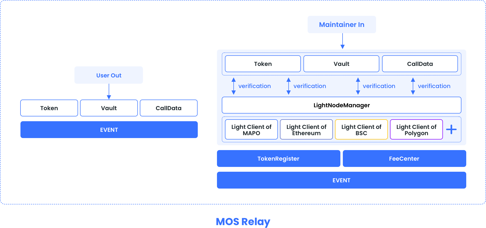

# Relay Chain Contract




## Contract Address

[Here to get MAPO mainnet and testnet MCS contract address.](/develop/mos/mcs/README.md)


## contract interface 

```solidity
interface RelayChainContract {
    
	function transferOutToken(address _token, bytes memory _to, uint256 _amount, uint256 _toChain) external;
    
    function transferOutNative(bytes memory _to, uint _toChain) external;
    
    function depositToken(address _token, address _to, uint _amount) external;
    
    function depositNative(address _to) external;
    
    function transferIn(uint256 _chainId, bytes memory _receiptProof) external;

    function withdraw(address _vaultToken, uint256 _vaultAmount) external;

}
```

## User Interface


### transferOutToken

Cross-chain transfer of tokens

#### function

function transferOutToken(address _token, bytes memory _to, uint256 _amount, uint256 _toChain) external

#### parameters

| parameter | type    | comment                                                      |
| :-------- | :------ | ------------------------------------------------------------ |
| _token    | address | Token address to transfer tokens from                        |
| _to       | bytes   | The destination chain receiving address of the token to be transferred out |
| _amount   | uint256 | Amount of tokens to be transferred                           |
| _toChain  | uint256 | Target chain id to transfer out                              |

### transferOutNative

Cross-chain transfer out of the native token

#### function

function transferOutNative(bytes memory _to, uint256 _toChain) external

#### parameters

| parameter | type    | comment                                                      |
| --------- | ------- | ------------------------------------------------------------ |
| _to       | bytes   | The destination chain receiving address of the token to be transferred out |
| _toChain  | uint256 | Target chain id to transfer out                              |

### depositToken

The deposit tokens are in the chain

#### function

function depositToken(address _token, address _to, uint _amount) external

#### parameters

| parameter | type    | comment                                                      |
| --------- | ------- | ------------------------------------------------------------ |
| _token    | address | Token address to transfer tokens from                        |
| _to       | address | The destination chain receiving address of the token to be deposited out |
| _amount   | uint    | Amount of tokens to be deposited                             |

### depositNative

The deposit native tokens are in the chain

#### function

function depositNative(address _to) external

#### parameters

| parameter | type    | comment                                                      |
| :-------- | :------ | ------------------------------------------------------------ |
| _to       | address | The destination chain receiving address of the token to be transferred out |


### withdraw

Withdraw staked tokens and earnings

#### function

function withdraw(address _vaultToken, uint256 _vaultAmount) external

#### parameters

| parameter    | type    | comment                   |
| ------------ | ------- | ------------------------- |
| _vaultToken  | address | valut token address       |
| _vaultAmount | uint256 | Amount of tokens withdraw |

## Messenger Interface


### transferIn

Perform cross-chain transfer

#### function

function transferIn(uint256 _chainId, bytes memory _receiptProof) external

#### parameters

| parameter     | type    | comment                       |
| ------------- | ------- | ----------------------------- |
| _chainId      | uint256 | source chain id               |
| _receiptProof | bytes   | source  chain  transfer proof |

### depositIn

Perform cross-chain deposit

#### function

function depositIn(uint256 _chainId, bytes memory _receiptProof) external

#### parameters

| parameter     | type    | comment                     |
| ------------- | ------- | --------------------------- |
| _chainId      | uint256 | source chain id             |
| _receiptProof | bytes   | source chain depsoit  proof |


## Data structure

ReceiptProof includes the proof and the receipt to prove.

```

struct receiptProof {

    // the block header where the receipt exists
    blockHeader header;
    // This is the structure that contains the transaction log
    TxReceipt txReceipt;
    // the index of the receipt in the block
    bytes keyIndex;
    // the proof to prove the existance of the above receipt
    bytes[] proof;

}

```