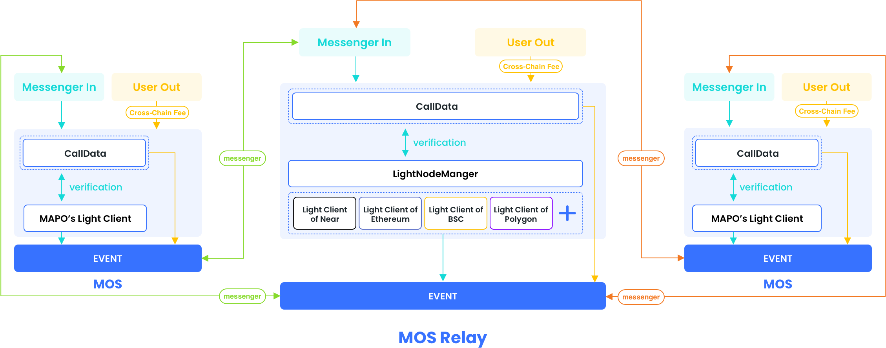

# MAP Omnichain Service (MOS) Message

MOS message enables projects built on one chain to easily synchronize some project information to other chains, and can also call contract methods on other connected chains.

MOS uses MAP Protocol light client to verify the transaction of cross-chain messages to ensure that cross-chain messages are authentic and checkable on the chain.

With MOS you can achieve interoperation with two chains:

- Call a contract on chain B from chain A.
- Pack the message changes in chain A and write them into chain B to realize message synchronization

## Prerequisites

- The application must be on one of the chains supported by MAP Protocol. See [chain names](https://docs.mapprotocol.io/develop/light-client) for a list of chains where MAPO light clients are deployed. The list is updated as new chains are added.
- The executable contract authority of the cross-chain message must be authorized to the MOS contract on the corresponding chain.
- Both chain A and chain B must have deployed the MOS message contracts(MOS message for Near Chain is still under development).

## How MOS completes cross-chain message

### At the source chain

1. The user (dApp) sorts out the messages that need to be cross-chained, and organizes the callData called by the target chain
2. The dApp calls the transferOut method of MOS, and pays the gas fee for the cross-chain
3. MOS sends a cross-chain transaction and pops up a cross-chain message log. You can view the details of the transaction on the browser of the source chain.

### At map relay chain

1. The messenger detects the message log on the source chain, and builds proof data from source chain, and calls the `transferIn` method to notify the MOS contract on relay chain.
2. The MOS relay contract (MOS contract on MAP relay chain) confirms the message log of the source chain, verifies the authenticity of the source chain transaction through the light client, judges that it is going to another chain, sends the transaction, and continues to pop up the cross-chain message log. 
3. If MAP relay chain is the target chain, execute the call method and pop up the execution log.

### At the destination chain

1. Messenger detects message log on the MAP Relay Chain, and builds proof data from relay chain, and calls the `transferIn` method to notify the MOS contract on destination chain.
2. The MOS contract verifies the authenticity of MAPO's message log through the light client. 
3. The destination chain pops up the execution log, and completes the message cross-chain contract call.

## Flow architecture

