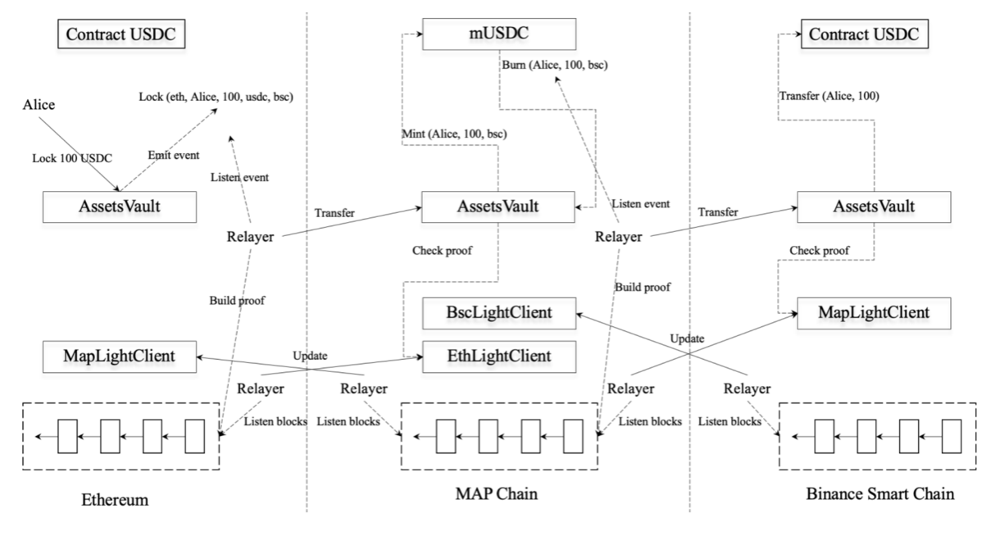

# How it works
The main task of MAP chain is to maintain this anchor trust in a purely mathematical way so that users of MAP protocol need to trust only the safety of the cryptographic primitives that already form the foundation of the whole blockchain universe.

## MAP’s Architecture
Let’s illustrate what really happens behind the scene if a user is using MAP protocol to move 100 USDC from Ethereum to BSC via MAP chain.

* STEP 1:

(*on user side*) Alice interacts with contract AssetsVault on Ethereum, to lock her 100 USDC to the vault.

(*behind transaction*) After the transaction is packed and successfully executed by Ethereum, Lock event is emitted indicating that Alice has indeed locked 100 USDC in contract AssetsVault to move the fund to BSC.

* STEP 2:

(*behind transaction*) If the transaction is packed and during the execution of this transaction, contract AssetsVault on MAP chain queries contract EthLightClient to get the Merkle root at the corresponding block height and validate the cryptographic proof carried in the transaction.

(*behind transaction*) If the cryptographic proof passes the check and the corresponding event is not processed, contract AssetsVault will instruct contract mUSDC to mint 100 mUSDC for Alice.

(*behind transaction*) Then in the same transaction, the minted 100 mUSDC is burned and an event is emitted indicating that Alice is burning 100 mUSDC in order to have 100 USDC on BSC.

* STEP 3:

(*behind transaction*) If the transaction is packed and during the execution of this transaction, contract AssetsVault on BSC queries contract MapLightClient to get the Merkle root at the corresponding block height and validate the cryptographic proof carried in the transaction.

(*behind transaction*) If the cryptographic proof passes the check and the corresponding event is not processed, contract AssetsVault will transfer 100 USDC to Alice’s address.

(*on user side*) Now Alice’s 100USDC has been successfully transferred from Ethereum to BSC.

Note that if Alice is transfer 100 USDC from Ethereum to MAP chain, then she will end up with 100 mUSDC sitting in her address on MAP chain. No trusted parties are involved in the above processing. All state changes related the assets moving are driven by the proper cross-chain messages with cryptographic proof submitted by relayers. In the above procedure, Alice only needs to send on transaction and all the rest are taken care by relayers in a pure trustless way

## A detailed mechanism of Relayers

Relayers will submit the update of interested chains to MAP chain, MAP chain then verify and update corresponding light client. Besides, relayers will also listen to cross-chain tx in the target chain and submit tx info via some tx types to notify the chain. The chain will then verify the cross-chain tx message according to the state info of the corresponding light client. Besides, relayers can also participate in the on-chain random number generation process by submitting a random number of their own. All random numbers submitted will be merged to forge true on-chain randomness to support various DeFi applications.

### A detailed mechanism of Light Client

The diagram below illustrates the flow on how a MAP light client and relayers work in cross-chain asset transfer of 100 USDC on Ethereum from Alice to Bob on MAP chain.

### Asset Layer of MAP Protocol

The MAP assets layer is composed of bulletproof smart contracts dealing with cross-chain transfers and guarding users’ funds. There is no privileged admin in the system and all asset-related operations such as minting, burning, and more can only be triggered with a cross-chain message backed by valid cryptographic proof, e.g., a Merkle proof. The cryptographic proof is checked against the information provided by the client clients.
