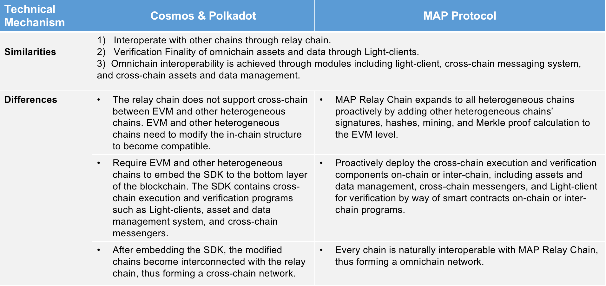
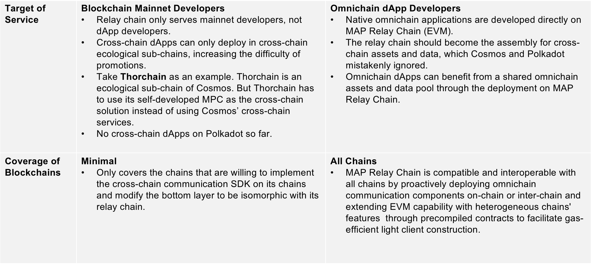

## MAP Protocol VS Cosmos & Polkadot

MAP protocol shares lots of similar features of Polkadot and Cosmos, i.e. *Interoperate with other chains through relay chain*, *Verification Finality of cross-chain assets and data through Light-clients*, *Cross-chain interoperability is achieved through modules including light-client, cross-chain messaging system, and cross-chain assets and data management*.

