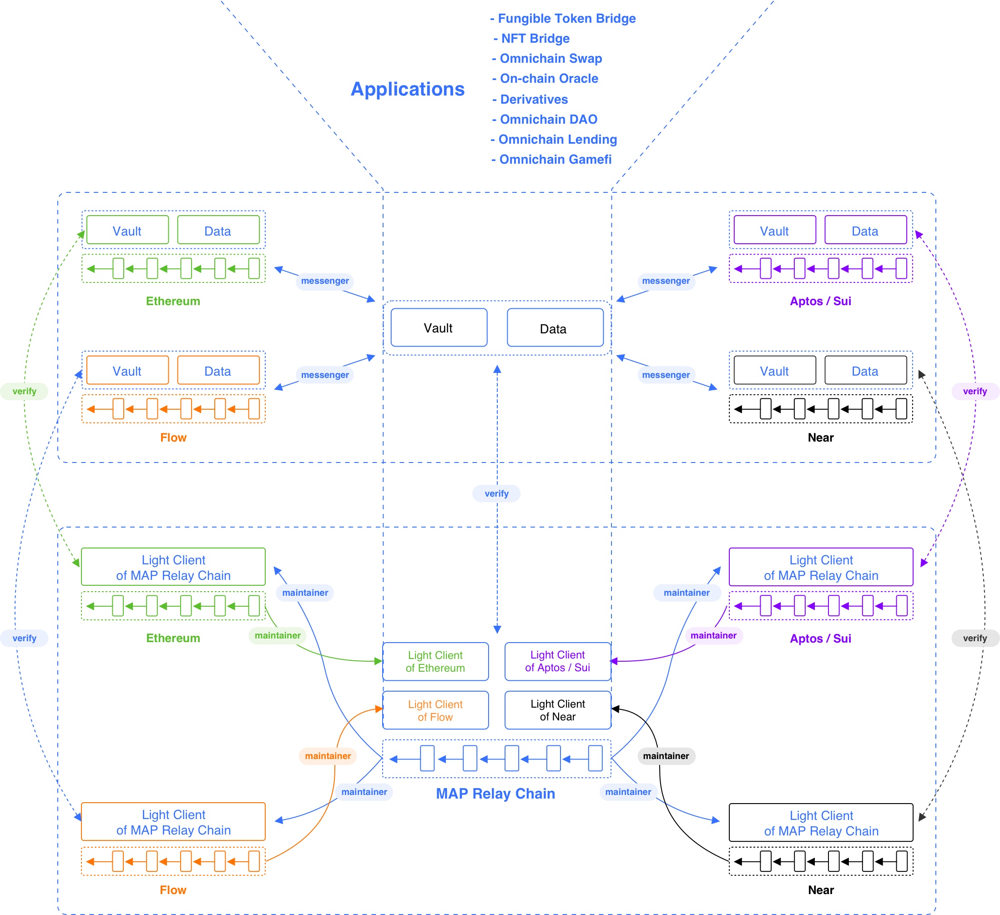

MAP Protocol is structured in **three layers**: **MAP Protocol Layer**, **MAPO Services Layer(MOS)**, and **MAPO Application Ecosystem Layer**.

## MAPO Application Layer

- Assets and data originated from dApps assembly on MAP Relay Chain
- DApps can achieve interoperability because of MAPO Services (MOS)
- The finality of omnichain data and asset verification network by MAP Protocol Layer empowers dApps to grow limitless.

## MAPO Services Layer (MOS)

- Facilitate dApp developers to build applications, similar to Google Mobile Services to Android ecosystem.
- Consists of Vaults and Data deployed on each chain, and Messenger Program to transmit messages between chains.
- The execution layer for omnichain asset and data.
- DApp developers can build their components or use MOS.
- Developers can utilize Vaults and Data in MSC and share Vaults and Data liquidity with other applications.
- Messenger Program is an SDK deployed, operated, and maintained by dApp developers. DApp developers can also independently and flexibly incentivize messenger contributors for transmitting omnichain messages for the dApp. 
- The self-verification mechanism of the Light-client on the MAP Protocol Layer assures the invalidity of malicious attacks from messengers. 

## Protocol Layer - Construct the CORE of Omnichain Network Infrastructure: Verification Finality Network and dApp Deployment 

- Consists of: MAP Relay Chain, Light-Client deployed on each chain, and inter-chain Maintainer Program to update and maintain Light-Client status.
- MAP Relay Chain proactively extends and supports heterogeneous blockchains' features in virtual machine, which construct a gas-efficient Light-Client verification network.
- Light-Client deployed on each chain has the characteristics of independent self-verification and verification finality, which becomes the verification network for cross-chain assets and data. 
- The Maintainer is an independent inter-chain program responsible for updating the status of Light Clients. The mechanism of the Light-client assures the invalidity of malicious attacks from maintainer. 

