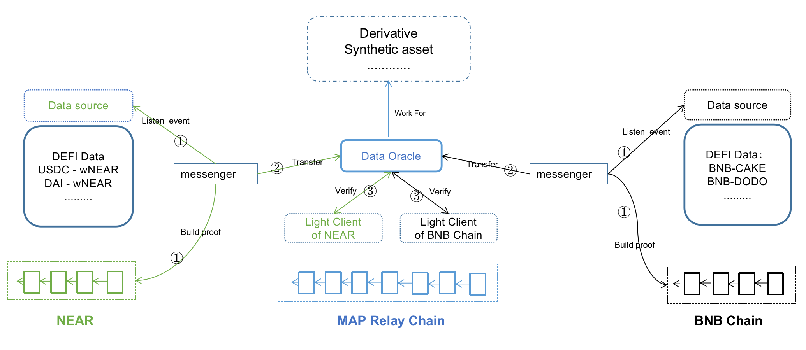
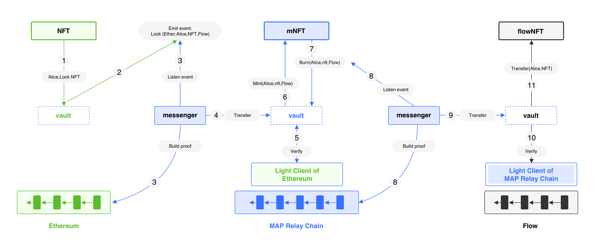

來源於Dapp的資產和數據在MAP中繼鏈上組裝。由於MAPO服務（MOS），Dapps可以實現互操作性。通過MAP協議層，全能鏈數據和資產驗證網絡的最終結果使Dapps能夠無限增長。
## 跨鏈借貸

目前，如果一個用戶在A鏈上有錢，但想在B鏈上farming，那麼這個用戶必須經過9個步驟：

在A鏈上抵押 -> 借款 -> 過橋（費用） -> 交換（費用） -> 在目的鏈上耕種 -> 交換回來（費用） -> 過橋回來（費用） -> 償還貸款 -> 取消抵押。

通過MAP協議，你可以在A鏈上抵押，在目的鏈上借款，養殖，還款，抵押物就解鎖了，跳過了四個橋接和交換費用。

## Omnichain Swap

Omnichain Swap通過連接最好的跨鏈DeFi協議，讓你以大大低於傳統DeFi交易所的費用進行換幣。通過使用MAP協議，開發者可以建立一個真正去中心化的Omnichain交易所，使用戶可以交換任何鏈上的任何代幣。

Omnichain SWAP還可以通過連接每一個主要的DEX流動性來實現全能鏈的聚合交換。現有的AMMs可以被包裝起來，以執行從一種資產到另一種資產的全息交換，而不需要修改任何現有的代碼。用戶將能夠在一次交易中從以太坊的ETH換到Near的Near。

在用MAP協議構建的全鏈交換中，用戶可以在一個池子裏增加多鏈幣的流動性，這意味着向來自不同鏈的一對代幣提供流動性成爲可能。用戶可以直接用一個代幣交換不同鏈的另一個鏈的代幣，而不使用任何中間代幣，如穩定幣，實現全鏈交換的最短路徑。

**ButterSwap**，第一個真正去中心化的跨鏈交易所，使用戶能夠交換任何鏈上的任何代幣，包括上述所有功能，並將在2022年第四季度發佈。
Butter

## Omnichain GameFi

隨着加密貨幣行業和元空間理念的蓬勃發展，很多創新理念被帶到了傳統的遊戲領域。遊戲金融指的是金融系統的遊戲化，通過參與遊戲賺錢的加密貨幣遊戲來創造利潤。玩賺遊戲與傳統遊戲不同，因爲玩家參與遊戲是爲了賺取獎勵，玩家可以創造遊戲中的資產，完全控制所有權。

GameFi的壽命在很大程度上取決於人氣和用戶的遊戲體驗。爲了保持人氣，新的玩家來源是關鍵，最好的方法是擴展到其他鏈，以便其他鏈的用戶可以參與。通過MAP協議，GameFi項目可以在多個鏈上部署其代幣，並允許來自其他鏈的用戶高效、安全地將其資產轉移到他們項目的鏈上。例如，一個BSC GameFi項目將其代幣部署在Polygon和WAX鏈上；來自Polygon和BSC的用戶可以通過跨鏈橋將其資產轉移到WAX並參與GameFi，從而成倍地增加用戶羣。

另一種可擴展並保持良好遊戲體驗的方式是直接部署在MAP Relay Chain上。利用MAP Relay Chain的互操作性，GameFi項目可以通過部署在MAP Relay Chain上，自動與所有EVM和非EVM鏈高效、安全地連接起來。MAP Relay Chain會主動與所有即將到來的鏈進行連接，這樣GameFi項目就可以專注於用戶體驗，而不必擔心擴展性和安全問題。

##鏈上預言機和衍生品

去中心化的衍生品和合成資產通常受制於源自其他鏈的資產價格和數量的準確性和及時性。這個問題可以通過多鏈部署來解決，但這是非常複雜的。通過建立一個可靠的全鏈網絡，MAP協議實現了數據跨鏈，並正在培育一個全新的甲骨文市場--鏈上甲骨文。通過在MAP中繼鏈上的部署，衍生和合成資產應用可以很容易地從On-Chain Oracle獲取可靠的多鏈數據。

### MAP協議全息網應用的圖解--數據

去中心化的衍生品和合成資產通常受制於資產價格的準確性和及時性，以及來自其他鏈的數量。這個問題可以通過在多個鏈上的部署來解決，但卻非常複雜。通過建立一個可靠的跨鏈網絡，MAP協議實現了數據全鏈，並正在培育一個全新的甲骨文市場--**鏈上甲骨文。通過部署在MAP中繼鏈上，衍生和合成資產應用可以輕鬆地從On-Chain Oracle獲取可靠的多鏈數據。

## 可變通的代幣和NFT橋

跨鏈橋和跨鏈NFT橋不再需要建立其基礎設施或使用MPC。使用MAP的底層跨鏈驗證網絡與最終性和MCS應用開發者服務包，橋接器開發者可以輕鬆建立他們的NFT或同質化代幣橋接器應用。

*像USDC這樣的可變通代幣在多個鏈上同時發行。Dapp開發者需要在MAP跨鏈服務的保險庫中提交可替換代幣是否在多條鏈上發行，以避免在全能鏈過程中創建不同形式的相同資產。

### MAP協議全能鏈應用說明--非可替代代幣（NFT）

## 全能鏈治理--Aave的案例

正如其開發者所講述的那樣，在Aave上執行的一項提案，是建立在以太坊（ETH）網絡上的，被髮送到Polygon（MATIC）FxPortal。然後，該機制讀取以太坊數據，並將其傳遞給Polygon網絡進行驗證。之後，Aave跨鏈治理橋接合約收到了這些數據，對其進行解碼並排隊行動，等待時間鎖定來完成。開發團隊寫道：

Aave 跨鏈治理橋是以一種通用的方式建立的，可以很容易地適應與任何支持 EVM 和跨鏈信息傳遞的鏈一起操作。目前，該資源庫支持與Polygon和Arbitrum的合約橋接。在Aave上，用戶可以提交Aave改進協議，或AIP，以針對DeFi平臺的各種功能。

憑藉MAP協議與所有鏈的互操作性，全能鏈管理可以通過安全的跨鏈基礎設施與所有EVM和異質鏈實現。

## MAP協議上的全能鏈應用

Dapp開發者只需要在MAP中繼鏈上部署他們的dapp，並完成MAPO服務模塊，然後享受連接整個區塊鏈世界的流動性的特權。開發者只需兩個步驟就可以輕鬆建立他們部署在任何鏈上的全能鏈應用程序：

1. 使用我們的SDK構建鏈間信使。
2. 2.通過我們的API與鏈上金庫和數據進行互動。

| Dapp分類 | 截至2022年4月，MAP協議上正在開發的項目 |
| ---- | ---- |
| 可置換的代幣橋 | Butter 橋 |
| NFT Bridge | CoLAB NFT Bridge |
| 跨鏈NFT合作平臺 | CoLAB |
| 跨鏈互換 | ButterSwap |
| 跨鏈DAO | Idavoll DAO |
|MAP中繼鏈互換 | HiveSwap |
| 鏈下Oracle | Nest |
| 鍊上Oracle | 鍊上Oracle
| 跨鏈農場 | UniFarm|
| 跨鏈GameFi | Nextype, Spiritland |
| 錢包 | BeFi Wallet DAO, Bitkeep, MathWallet, Coin98
| 支付 | 鍊金術支付 |
| DeFi系統 | Ecentive |
| 質押服務 | Kucoin, Ankr, Hashquark, 01Node, Allnodes, Infstone |