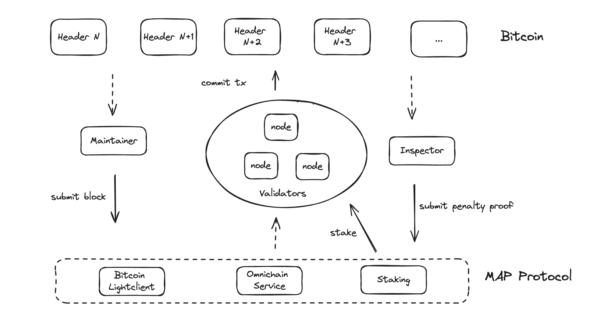

# Interact with Bitcoin

Here's a breakdown of a solution to MAP Protocol interact with Bitcoin:

## Components

### Bitcoin Light Client
A Bitcoin SPV (Simplified Payment Verification) contract will be deployed on the MAP Protocol to synchronize Bitcoin block headers. 
This contract will allow verification of Bitcoin on-chain transactions by leveraging SPV proofs, ensuring the validity of cross-chain transactions involving Bitcoin trustlessly.

### Omni-chain Service
An Omni-chain service contract will be deployed on the MAP Protocol to facilitate cross-chain interactions between Bitcoin and other blockchain networks. 
The contract will process and manage cross-chain requests, such as transfers and other state changes, between Bitcoin and the supported chains.

### Staking Contract
A staking contract will be established to allow participants to stake $MAPO and become validator nodes.
If validators behave maliciously or act against protocol rules, they will be penalized via a slashing mechanism in the staking contract. 
Staked assets will be at risk of punishment in the event of malicious behavior.
Validators are responsible for verifying and processing cross-chain transactions. 

## Roles

### Maintainer
Maintainers are responsible for monitoring the Bitcoin blockchain. 
They will submit block headers to the Bitcoin Light Client contract on MAP Protocol and relay cross-chain transactions from Bitcoin to the Omnichain service. 
Maintainers play a key role in ensuring the timely and accurate submission of Bitcoin data to the MAP Protocol.

### Validator
Validators listen for cross-chain transaction requests emitted by the Omni-chain service. 
Once a cross-chain transaction is initiated, validators, using MPC (Multi-Party Computation) protocols, collaboratively generate and sign the cross-chain transaction destined for the Bitcoin network. 
Validators then submit the finalized Bitcoin transaction to the Bitcoin blockchain, ensuring the cross-chain interaction is processed.

**Now Validators are selected from trusted ecosystem partners, ensuring they have an active role in managing and securing cross-chain interactions.**

### Inspector
The Inspector is responsible for monitoring the behavior of validators. It listens for validator actions, particularly those related to cross-chain transactions. 
If the Inspector detects malicious behavior or an invalid transaction submitted by a validator, it submits the evidence of the wrongdoing to the staking contract. 
The staking contract will then execute the penalty mechanism to slash the stake of the offending validator, ensuring protocol security and integrity.

