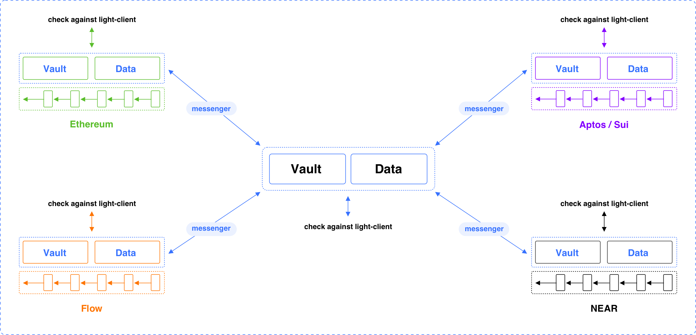

雖然不可能一勞永逸地捕捉和滿足所有跨鏈Dapp的需求，但各種跨鏈Dapp確實有共同的基礎設施，例如，跨鏈橋和跨鏈交換都需要處理跨鏈轉移可替代或不可替代的資產。爲此，MAP協議提供了MAPO服務（MOS），以提供跨鏈Dapp所需的通用模塊，從而進一步降低使用MAP協議構建跨鏈Dapp的門檻。理想情況下，通過MAP協議，試圖建立跨鏈交換Dapps的開發者只需要關注交換部分。單純的MOS不能滿足所有的需求，因此MOS也提供了所有需要擴展現有模塊的設施。
跨鏈轉賬的資產管理是相當容易出錯的，通常會有一個超級管理員，能夠接觸到用戶資金。如今，跨鏈轉移是跨鏈互操作性的重要組成部分，MOS提供了一個不可信任的、堅實的AssetVault模塊，以減輕MAP生態系統建設者在技術挑戰和安全風險方面的負擔。爲了幫助理解MAP協議以及MOS提供的功能，我們利用MOS提供的資產保管模塊來說明跨鏈傳輸的工作流程。AssetVault模塊由處理跨鏈轉移和保護用戶資金的防彈智能合約組成。沒有特權的管理員，所有與資產相關的操作，如造幣、燒燬等，只能通過有效的加密證明（如Merkle證明）支持的跨鏈信息來觸發。加密證明是根據輕客戶提供的信息進行檢查的。

假設MAP協議已經支持Ethereum和Binance智能鏈，Alice想用MAP協議從Ethereum向BSC轉移100 USDC。請注意，在Alice做任何事情之前，MAP協議已經在Ethereum和BSC上部署了MAP中繼鏈的輕客戶端，稱爲MapLightClientOnEth和MapLightClientOnBsc，並且信使根據MAP中繼鏈的增長情況持續更新這兩個輕客戶端。同時EthLightClientOnMap和BscLightClientOnMap已經部署在MAP中繼鏈上，信使已經根據以太坊和BSC的更新來更新這兩個輕客戶端。同時，在MAP中繼鏈、以太坊和BSC上也部署了一個AssetVault合約。

跨鏈資產被鎖定在源鏈上的AssetsVault合約中。對於轉移到MAP Relay Chain的資產，MAP Relay Chain將包裹來自不同鏈的所有資產，例如，mUSDC是MAP Relay Chain上包裹的USDC，用於Ethereum、BSC等的USDC。讓我們來說明一下，如果Alice使用MAP協議，通過MAP中繼鏈將100個USDC從以太坊轉移到BSC，背後到底發生了什麼。

1. 愛麗絲與以太坊上的合約AssetsVault互動，將她的100美元鎖定在AssetsVault。

a. 在交易被打包並由以太坊成功執行後，會發出一個鎖定事件，表明Alice確實在AssetsVault中鎖定了100美元，將資金轉移到BSC。

2. 一個信使發現了AssetsVault在Ethereum上發出的Lock事件，並建立Merkle證明，以證明這個事件是AssetsVault在某個區塊高度發出的。準備好所有的信息後，這個信使在MAP中繼鏈上向AssetsVault提交了一個適當的交易。

a. 在交易打包後，在這個交易的執行過程中，MAP中繼鏈上的AssetsVault查詢合約EthLightClientOnMap以獲得相應區塊高度的Merkle根，並驗證交易中攜帶的加密證明。

b. 如果加密證明通過了檢查，並且相應的事件還沒有被處理，AssetsVault將指示合約mUSDC爲Alice鑄造100mUSDC。

c. 然後在同一筆交易中，鑄幣的100MUSDC被燒燬，併發出一個事件，表明Alice正在燒燬100MUSDC，以便在BSC上擁有100USDC。

3. 3.一個信使在MAP中繼鏈上發現了mUSDC合約發出的燃燒事件，並建立了相應的Merkle證明，以證明這個事件是由MAP中繼鏈的某個區塊高度的mUSDC合約發出的。準備好所有的信息後，這個信使向BSC的AssetsVault合約提交了一個包含燃燒事件、Merkle證明以及區塊頭的適當交易。

a. 如果該交易被打包，在該交易的執行過程中，BSC上的AssetsVault查詢合約MapLightClientOnBsc，以驗證區塊頭是否有效（通過檢查嵌入在區塊頭中的聚合簽名），並從經過驗證的區塊頭中提取Merkle根，以進一步驗證該交易中攜帶的加密證明。

b. 如果加密證明通過了檢查，並且相應的事件還沒有被處理，合約AssetsVault將向Alice的地址轉移100USDC。現在Alice的100USDC已經成功地從Ethereum轉移到BSC。

請注意，如果愛麗絲將100美元從以太坊轉移到MAP中繼鏈，那麼她最終會有100個mUSDC放在她在MAP中繼鏈的地址中。在上述處理過程中，沒有受信任方參與。所有與資產移動相關的狀態變化都是由信使提交的帶有加密證明的適當的跨鏈信息驅動的。在上述過程中，Alice只需要發送一筆交易，其餘的都是由信使以純粹的無信任方式處理的。

### MAP協議的MAP全鏈服務（MOS）層的說明

## Messenger 信使
- 什麼是信使？信使是一個獨立的鏈間程序。信使監聽程序中預設的相關事件，並在源鏈的賬本上建立一個證明；然後將事件的信息和證明傳送給目的鏈上的Vault或Data。
- 信使需要爲omnichain用戶預付MAP中繼鏈和目的鏈的氣體費用，從而從應用中獲得獎勵。
- 由於目的地鏈的氣體費用無法估計，由於MAP協議採用的絕對性原則，MAP協議層不能將這個過程納入底層網絡。
- 應用程序的靈活性爲信使提供了許多可能性，應用程序可以向全能鏈用戶收取靈活的交易費用，並相應地獎勵信使。
- 作爲MAPO服務的一個主要組成部分，Messenger SDK對dApp開發者開放。
- Messenger是一個高併發的鏈間程序。理論上，只要一個誠實的信使在鏈間工作，dApp的所有跨鏈交易信息都可以被傳輸。
- 信使的惡意攻擊不會導致資產的損失，只會導致MAP協議層的驗證無效。

## Vault & Data
- 在源鏈上，Vault & Data負責接收資產或數據，並觸發一個事件讓信使監聽。
- 在中繼鏈或目的鏈上，Vault & Data負責接收信使傳送的跨鏈信息，然後通過內部組件--路由器來安排並通過部署在目的鏈上的源鏈Light-Client進行跨鏈交易的驗證。- 當驗證完成後，Vault & Data將記錄相應的指令。
dApp開發者可以部署vault & Data。他們還可以通過MAPO服務的Vault & Data分享資產庫或數據池的流動性。