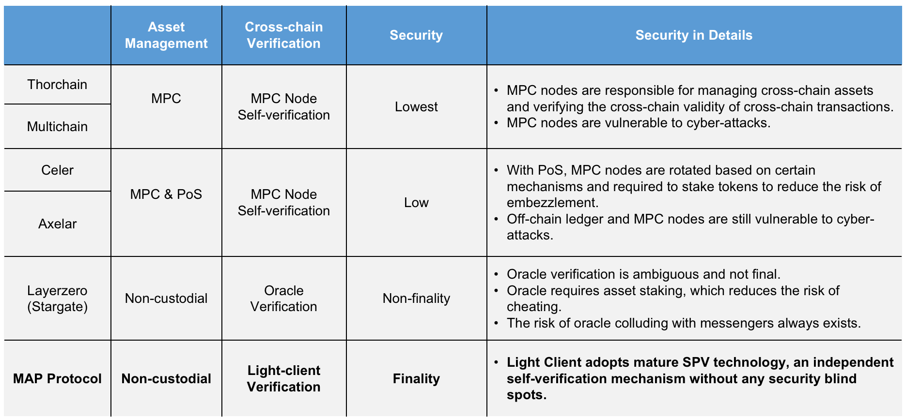

## MAP Protocol VS cross-chain solutions without relay chain

### Comparisons between MAP Protocol and other lightweight cross-chain solutions with no relay chain

- The above lightweight solutions, including MAP Protocol, achieved cross-chain functionality by deploying cross-chain communication components on-chain or inter-chain, which are better solutions than Cosmos & Polkadot (require embedding SDK to the bottom layer of the blockchain);
- MPC (Multi-Party Computation) technology is easy to develop but has obvious security risks. 
- Using Oracle to conduct cross-chain verification is ambiguity , and the risk of colluding with messengers always exists. 
- Using Light-client to conduct cross-chain verification is the ultimate security mechanism adopted in MAP Protocol, Cosmos, and Polkadot. 
- The Light-client verification mechanism will lead to massive consumption of gas fees for cross-chain activities between heterogeneous chains. The better way is to use a relay chain, compatible with multiple chains' algorithm, thus enabling a homogeneous cross-chain and forming the ultimate cross-chain verification network. MAP Protocol has developed the MAPO Relay Chain as such. 
- As the cross-chain asset and data assembly, MAPO Relay Chain supports the native deployment of omnichain dApps, including cross-chain bridge applications,  differentiating MAP Protocol from all the other competitors.
