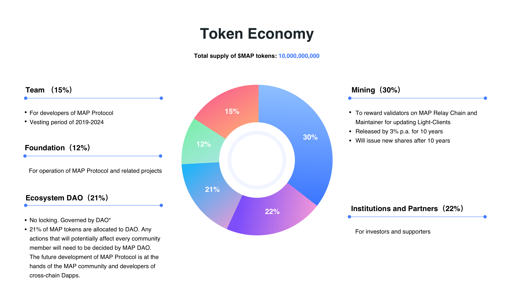

### DAO Governance

In the token distribution model of $MAP, 21% are allocated to MAP DAO, which $MAP holders will govern. Any actions that will potentially affect every community member will need to be decided by MAP DAO. The future development of MAP Protocol is at the hands of the MAP community and developers of cross-chain Dapps.
