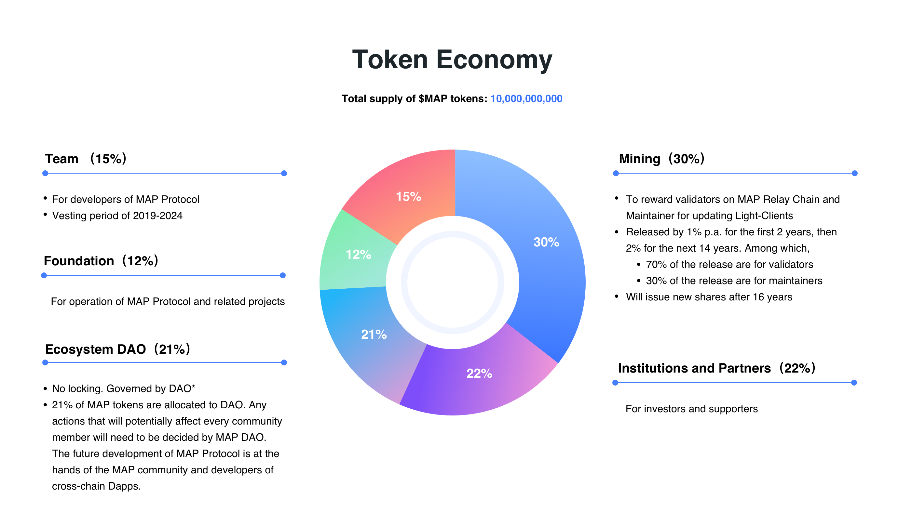

# MAPO Token

MAPO is the native cryptocurrency of MAP Protocol. It is the digital money that opens the door for you to access the Bitcoin-level peer-to-peer omnichain network.

## Token Distribution

### DAO Governance

21% of MAP tokens are allocated to DAO. Any actions that will potentially affect every community member will need to be decided by MAP DAO.

## Role of MAPO

### Fueling MAP Protocol

MAPO is the heart of MAP Protocol. When you send MAPO or use an app on MAP Protocol, you'll pay a fee in MAPO to use the MAP Protocol network. This fee serves as an incentive for a block producer to process and verify your activity on the network.

Validators are like the gatekeepers of MAP Protocol—they check and ensure all the transactions are valid and accurate. They are randomly selected to verify new translations and add them to a blockchain. Validators will be rewarded with a small amount of MAPO for the work they do.

### Underpinning the Omnichain Financial System

Moving beyond mere transactions, the omnichain community is crafting an all-encompassing financial network that is peer-to-peer and universally accessible. Currently, users can earn MAPO through staking. As MAP Protocol evolves and expands, forthcoming functionalities like borrowing and lending will be introduced, broadening the utility of MAPO.

### Growing Use Cases

Because MAP Protocol is programmable, developers can shape MAPO in countless ways:

- **Swap tokens with [ButterSwap](https://www.butterswap.io/)** — you can trade MAPO with tokens on multiple different chains.
- **Earn interest by [staking](https://staking.mapprotocol.io/)** — stake MAPO and get rewarded.
- **Get stablecoins** — access the world of cryptocurrencies with a steady, less volatile value.

## Getting MAPO

Users can get MAPO from a centralized exchange or decentralized exchange. You can also become a validator or participate in staking to earn MAPO as a reward.

## Staking MAPO

Staking is the process of participating in a proof-of-stake (PoS) consensus mechanism to support the operations of a blockchain network. Participants lock up a certain amount of cryptocurrency in a wallet to help validate transactions, secure the network, and produce new blocks. In return, participants usually receive additional tokens as rewards.

In MAP Protocol, staking is the act of locking certain amounts of MAPO into the MAP Protocol Validator Pool. Both validators and users can participate in staking.

- **Validators**: Once validators have configured their Validator node, they need to have 1 Million MAPO in their staking pool.
- **Users**: Users can participate in staking by delegating their MAPO to the stake of a particular Validator; in this way, they help that Validator operate and earn a percentage of rewards based on their stake.

## Query MAPO Balance

Users can query the MAPO balance of any account by inspecting the account's balance field, which shows MAPO holdings denominated in Gwei. [Maposcan](https://maposcan.io/) is the tool to inspect address balances via a web-based application. Account balances can also be queried using wallets or directly by making requests to nodes.

## Related Documentation

- [Become a Validator](../validator/become-validator.md)
- [Voting](../validator/vote.md)
- [DAO Governance](./dao.md)
